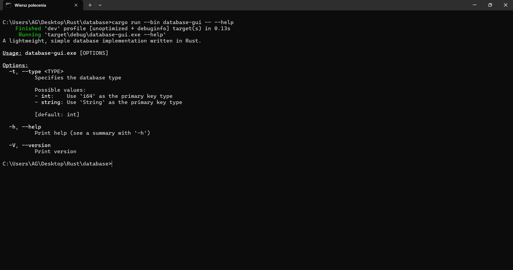
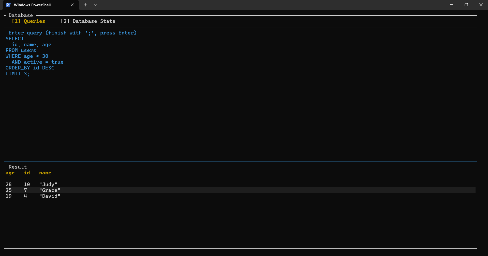
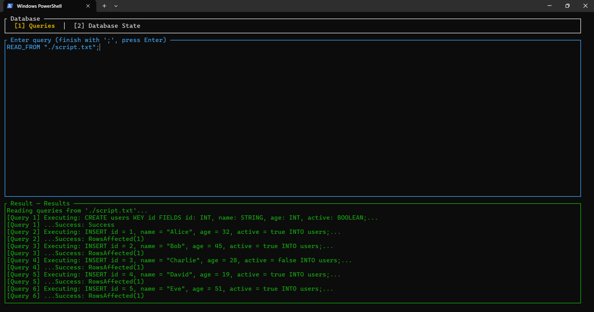
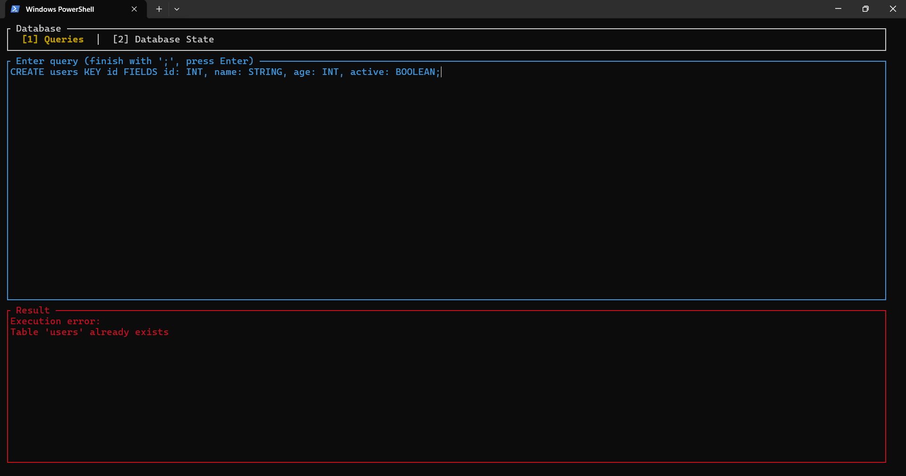

# 💾 Database

A simple, lightweight SQL-like in-memory database engine written in `Rust`.

## Building and Running

The project consists of a core library `database` and two binaries:

- `database-cli`,
- `database-gui`.

```bash
cargo run --bin database-cli -- --type int
cargo run --bin database-gui -- --type string
```

<p align="center">
  
</p>

## TUI (Text User Interface)

- Controls:
  - `[Tab]`: Switch between the `Queries` and `Database State` tabs.
  - `[Esc]`: Quit the application.
- In `Queries` Tab:
  - Type your query. Multi-line input is supported.
  - `[Enter]`: Adds a newline (if not finished) or executes the query (if it ends with `;`).
  - `[Arrow Keys]`: Move the cursor.
  - `[Backspace]`: Delete text.

### Queries Tab

<p align="center">
  
</p>

### Database State Tab

<p align="center">
  
</p>

### Running Scripts

<p align="center">
  
</p>

### Execution Errors

<p align="center">
  
</p>

## Supported Syntax

All queries must be terminated with a semicolon (`;`).

### `CREATE`

```sql
CREATE TABLE people KEY id FIELDS id: INT, name: STRING, age: INT;
```

### `INSERT`

```sql
INSERT INTO people id = 1, name = "John", age = 21;
```

### `DELETE`

```sql
DELETE 1 FROM people;
```

### `SELECT`

```sql
SELECT id, name FROM people;
SELECT id, name FROM people WHERE age > 20;
SELECT name FROM people WHERE (age > 20 OR name = "Jane") AND id <= 10;
SELECT id, name, age FROM people ORDER BY age DESC LIMIT 5;
```

### Persistence & Scripting

```sql
DUMP_TO "path/to/my_db.bin";
LOAD_FROM "path/to/my_db.bin";
SAVE_AS "path/to/history.sql";
READ_FROM "path/to/script.sql";
```

## Architecture

```
database/
├── Cargo.toml
├── Cargo.lock
└── src/
    ├── ast/
    │   ├── clauses/
    │   │   └── ...
    │   ├── expressions/
    │   │   └── ...
    │   ├── statements/
    │   │   └── ...
    │   └── ast_error.rs
    ├── core/
    │   ├── models/
    │   │   └── ...
    │   ├── errors/
    │   │   └── ...
    │   └── types.rs
    ├── parsing/
    │   ├── query_grammar.pest
    │   ├── query_parser.rs
    │   └── parsing_error.rs
    ├── execution/
    │   ├── commands/
    │   │   └── ...
    │   ├── execute.rs
    │   └── execution_result.rs
    ├── tui/
    │   ├── ui/
    │   │   └── ...
    │   └── app.rs
    ├── bin/
    │   └── gui.rs
    ├── cli.rs
    ├── repl.rs
    ├── lib.rs
    └── main.rs
```

| Directory/File   | Description                                                                                                                                                                              |
| ---------------- | ---------------------------------------------------------------------------------------------------------------------------------------------------------------------------------------- |
| `src/ast/`       | Defines the data structures (e.g., `CreateStmt`, `SelectStmt`) that represent a parsed query. It's the 'contract' and common language between `parsing` and `execution` modules.         |
| `src/core/`      | Contains the model definitions (`Database`, `Table`, `Record`), data types (`DataValue`, `DataType`), and core errors (`DatabaseError`). This module knows nothing about SQL or parsing. |
| `src/parsing/`   | Its sole job is to convert a raw text string (`&str`) into an `ast::Command`. It contains the grammar (`.pest`) and the AST building logic (`QueryParser`).                              |
| `src/execution/` | Its job is to take an `ast::Command` (from the `parser`) and execute it against the `core::Database`. It defines the Execute trait and validation logic.                                 |
| `src/tui/`       | Contains all `ratatui`-specific logic (the `App` state, `ui` drawing, and keyboard event handling). It's a frontend that consumes the `database` library.                                |
| `src/cli.rs`     | A helper module for `main.rs`. Defines the command-line argument parsing logic (e.g., `--type string`) using `clap`.                                                                     |
| `src/repl.rs`    | A helper module for `main.rs`. Contains the REPL logic (handling `stdin`, multi-line buffering, and calling the `parser`/`executor`).                                                    |
| `src/lib.rs`     | The main library crate. It defines the public API for the database, exporting the `core`, `ast`, `parsing`, and `execution` modules.                                                     |
| `src/main.rs`    | The main binary (CLI) crate. Runs the simple REPL (Read-Eval-Print Loop) in the terminal.                                                                                                |
| `src/bin/hui.rs` | An additional binary (TUI) crate. Runs the graphical TUI using `ratatui`. It uses the `tui` module for all UI logic.                                                                     |

## Key Technologies:

| Technology                                        | Usage                                                                             |
| :------------------------------------------------ | :-------------------------------------------------------------------------------- |
| [`ratatui`](https://ratatui.rs/)                  | Used to build the entire interactive Text User Interface (TUI).                   |
| [`crossterm`](https://crates.io/crates/crossterm) | Acts as the backend for `ratatui`. Handles terminal control and keyboard events.  |
| [`clap`](https://crates.io/crates/clap)           | Used to parse command-line arguments (like `--type`) for the binaries.            |
| [`miette`](https://crates.io/crates/miette)       | Used to provide rich, pretty-printed error diagnostics in the terminal.           |
| [`thiserror`](https://crates.io/crates/thiserror) | Used to easily create the custom error enums (e.g., `DatabaseError`).             |
| [`bincode`](https://crates.io/crates/bincode)     | Used for fast binary serialization/deserialization for `DUMP_TO` and `LOAD_FROM`. |
| [`pest`](https://pest.rs/)                        | Used to define the SQL grammar and parse raw query strings into a parse tree.     |

## Favourite Module

My favourite modules in this project are `parsing` and `ast`.

These modules are where the raw text query, defined by a formal grammar (`query_grammar.pest`), is transformed into a structured, verifiable data model (`ast::Command`). I enjoy this part the most as it directly applies concepts from compiler design and formal language theory.

## Acknowledgements

Special thanks to [Szymon Zyguła](https://github.com/szymon-zygula) for providing the original idea for this project.

## License

This project is licensed under the MIT License.

## Author

The project was created by [Adam Grącikowski](https://github.com/adamgracikowski).
